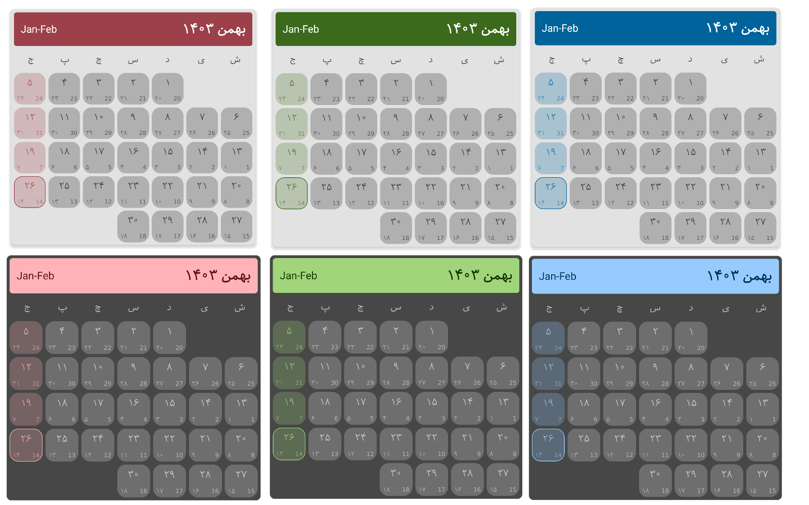

# Persian Calendar
An Android library built with jetpack compose - Persian calendar component. It's easy to use, quick to implement and can be customized according to your application color and theme.

[](https://jitpack.io/#AmirSinaRZ/PersianCalendar)



# Setup
Add the JitPack repository to settings.gradle file
```gradle
dependencyResolutionManagement {
    repositoriesMode.set(RepositoriesMode.FAIL_ON_PROJECT_REPOS)
    repositories {
        ...      
        maven { url 'https://jitpack.io' }
    }
}
```

Add the dependencies to app-level build.gradle file
```gradle
dependencies {
    ...
    implementation 'com.github.AmirSinaRZ:PersianCalendar:1.0.0'
}
```

## Preview
https://github.com/user-attachments/assets/c7ae8316-9fca-4479-aa62-29ced208dd1e


## Contributing
Contributions are welcome! If you find a bug or would like to create a new feature, please submit a pull request.

## License
This library is licensed under the  Apache-2.0 license. See [LICENSE](https://github.com/AmirSinaRZ/PersianCalendar?tab=Apache-2.0-1-ov-file)

Developed by Amirsina Razghandi
