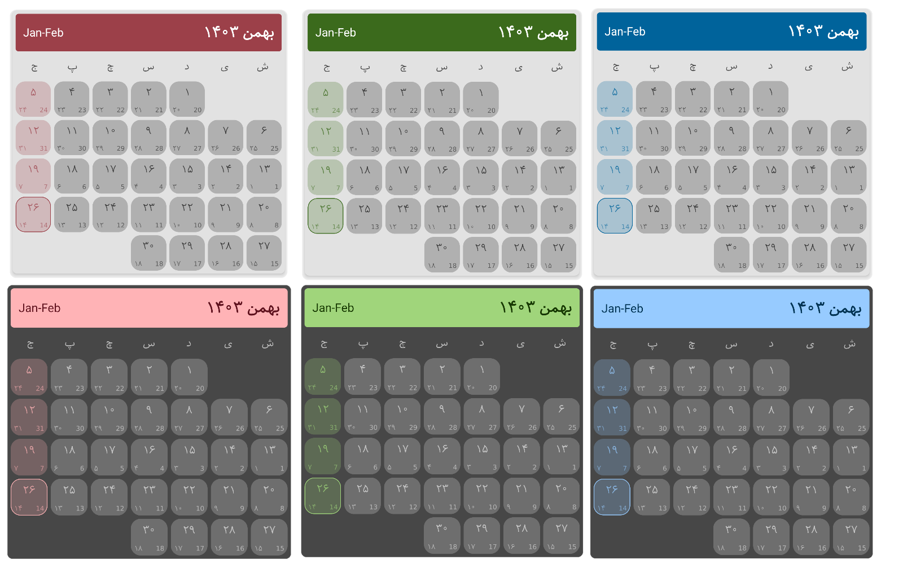

# Persian Calendar
An Android library built with jetpack compose - Persian calendar component. It's easy to use, quick to implement and can be customized according to your application color and theme.

[](https://jitpack.io/#AmirSinaRZ/PersianCalendar)



# Setup
Add the JitPack repository to settings.gradle file
```gradle
dependencyResolutionManagement {
    repositoriesMode.set(RepositoriesMode.FAIL_ON_PROJECT_REPOS)
    repositories {
        ...      
        maven { url 'https://jitpack.io' }
    }
}
```

Add the dependencies to app-level build.gradle file
```gradle
dependencies {
    ...
    implementation 'com.github.AmirSinaRZ:PersianCalendar:1.1.0'
}
```

# Usage
### simple usage
to show Persian calendar without any customization:
```kotlin
PersianCalendar { selectedDay ->
    //do something with date here
}
```
selectedDay is [CalendarDay.kt](https://github.com/AmirSinaRZ/PersianCalendar/blob/master/persiancalendar/src/main/java/com/amirsinarz/persiancalendar/model/JalaliDate.kt)
### usage with customization:
```kotlin
PersianCalendar(
    modifier: Modifier = Modifier,
    colors: PersianCalendarColors = PersianCalendarDefaults.getPersianCalendarColors(),
    fontFamily: FontFamily = PersianCalendarDefaults.persianCalendarFont(),
    viewModel: PersianCalendarViewModel = viewModel(),
    initDate: JalaliDate = viewModel.jalaliDate,
    events: List<CalendarEvent<*>> = emptyList(),
    elevation: Dp = 0.dp,
    contentPadding: Dp = 5.dp,
    cornerRadius: Dp = 8.dp,
    showFullWeekDay: Boolean = false,
    animate: Boolean = true,
    animatePerItem: Boolean = true,
    animationDuration: Int = 200,
    animationDelay: Long = 30L,
    onDateSelected: (CalendarDay)->Unit,
) 
```

## Preview
https://github.com/user-attachments/assets/c7ae8316-9fca-4479-aa62-29ced208dd1e


## Contributing
Contributions are welcome! If you find a bug or would like to create a new feature, please submit a pull request.

## License
This library is licensed under the  Apache-2.0 license. See [LICENSE](https://github.com/AmirSinaRZ/PersianCalendar?tab=Apache-2.0-1-ov-file)

Developed by Amirsina Razghandi
